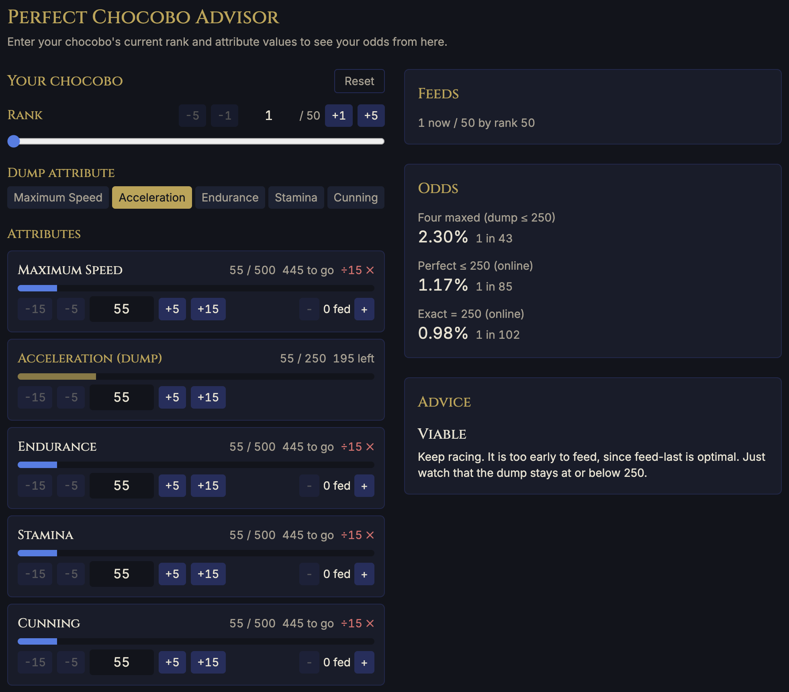

# Perfect Chocobo Advisor

Live odds and feeding advice for perfecting a final race chocobo in _Final Fantasy XIV_, computed
exactly in your browser.

[](https://github.com/kevinrutledge/ffxiv-chocobo-racing-calculator/actions/workflows/ci.yml) [](https://github.com/kevinrutledge/ffxiv-chocobo-racing-calculator/actions/workflows/deploy.yml) [](LICENSE)

**Live site.** https://kevinrutledge.github.io/ffxiv-chocobo-racing-calculator/

A fully bred chocobo caps all five attributes at 500, yet its lifetime growth cannot fill all five.
One attribute must be dumped, conventionally Acceleration, so the realistic goal is to perfect the
other four. This tool takes your bird's current state mid-raise and shows the odds of finishing
four-capped from here, along with what to do next.

## Preview



## Features

- Enter the current rank, the five attribute values, and the dump attribute, then read the odds
  from your exact state rather than from a fresh start.
- Three probabilities side by side, four maxed (dump at most 250), the perfect Grade-3 lineup at
  most 250, and the exact 500/500/500/500/250 lineup.
- A status band (guaranteed, viable, unlikely, doomed) and a per-target checklist that says which
  attribute to feed now, which to hold, and which to wait on for a divisible-by-15 window.
- Shareable state encoded in the URL, so a link reproduces the exact bird.
- Everything runs client-side. There is no backend, no tracking, and no account.

## How it works

The odds come from the exact analysis in the companion paper, ported to TypeScript and run
in the browser.

- Fixed-end feeding is an exact generating-function convolution.
- The adaptive Grade-3 lineup is an exact backward-induction Markov decision process over a
  collapsed state.
- The conditional evaluator runs the same model from any mid-raise state, so the displayed
  odds are always conditional on what you entered.

The math layer is a pure, dependency-free TypeScript module, and `npm run verify` reproduces
every published anchor from scratch (for example the 2.301513% four-maxed figure and the 1.170%
online optimum). Full derivations and proofs are in [docs/chocobo-racing-probability.tex](docs/chocobo-racing-probability.tex) and its
compiled [PDF](docs/chocobo-racing-probability.pdf). The verified game-mechanics reference is in [docs/chocobo-racing-research.md](docs/chocobo-racing-research.md).

## Tech stack

React 19, Vite 6, TypeScript, Tailwind CSS 4, and Zod for boundary validation. The math core
imports nothing, so the web app and the MCP server share it unchanged.

## Local development

```sh
npm install
npm run dev          # start the dev server
npm run build        # production build into dist/
npm run test         # Vitest suite
npm run typecheck    # tsc --noEmit
npm run lint         # ESLint
npm run format       # Prettier
npm run verify       # reproduce every math anchor as a guardrail
```

## Project structure

```
.
├── src/
│   ├── types/         # domain types, the single source of truth
│   ├── schema/        # Zod validation at the boundaries
│   ├── math/          # pure math core (model, binomial, chunked, dp, advisor)
│   ├── state/         # input reducer and URL encoding
│   ├── components/    # React UI
│   ├── app.tsx        # root component
│   └── main.tsx       # browser entry point
├── test/              # Vitest tests mirroring src/
├── mcp/server.ts      # MCP server
├── scripts/verify.ts  # install-free math-anchor verification
├── docs/              # paper (.tex and .pdf) and the game-mechanics reference
└── .github/workflows/ # CI and Pages deploy
```

## MCP server

An MCP server exposes the same math core over the Model Context Protocol. Run it with
`npm run mcp`. It provides a `chocobo_odds` tool that returns the odds and recommended action
for a given state, and it serves the paper and the game-mechanics reference as resources.

## Deployment

Two GitHub Actions workflows handle automation. `ci.yml` runs typecheck, lint, the math-anchor
guardrail, the test suite, and a build on every push and pull request. `deploy.yml` builds and
publishes the site to GitHub Pages on pushes to `main`.

## Disclaimer

This is an unofficial fan-made tool. _Final Fantasy XIV_ and all related content are trademarks
of Square Enix Holdings Co., Ltd. This project is not affiliated with or endorsed by Square Enix.

## License

MIT, see [LICENSE](LICENSE). Authored by Kevin Rutledge.
